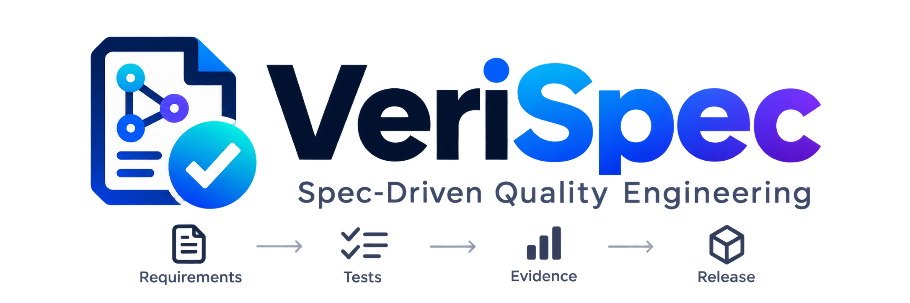

<p align="center">
  
</p>

<h1 align="center">VeriSpec</h1>

<p align="center">
  <strong>Spec-Driven Quality Engineering Framework</strong><br>
  <em>Turn development specifications into traceable test strategies, executable test suites, and continuous release evidence.</em>
</p>

<p align="center">
  <a href="https://github.com/godikemahesh/verispec/releases"></a>
  <a href="https://nodejs.org"></a>
  <a href="LICENSE"></a>
  <a href="#continuous-reporting-zero-setup"></a>
  <a href="#ai-coding-agent-support-thin-adapters"></a>
</p>

<p align="center">
  <a href="#what-is-verispec">Overview</a> •
  <a href="#installation--setup">Installation</a> •
  <a href="#verispec-workflow">Workflow</a> •
  <a href="#the-machine-readable-quality-graph">Quality Graph</a> •
  <a href="#failure-classification-model">Failure Triage</a> •
  <a href="#when--how-to-use-each-command">Command Guide</a> •
  <a href="#continuous-reporting-zero-setup">Continuous Reporting</a> •
  <a href="#ai-coding-agent-support-thin-adapters">AI Agents</a>
</p>

---

## What is VeriSpec?

**VeriSpec** brings the structured workflow, review gates, and consistency analysis philosophy of GitHub's **Spec Kit** into **Quality Engineering (QE)**.

Development teams own `spec.md`. VeriSpec consumes that specification, enforces quality standards through a permanent testing rulebook, and establishes an unbroken chain of machine-readable evidence:

| Traceability Link | Artifact | Role & Output |
|:---|:---|:---|
| **1. Specification** | `spec.md` | Functional & non-functional requirements authored by product/development |
| **2. Rulebook** | `.verispec/rulebook.md` | Project testing policy: defines test types (Unit/API/E2E), languages, quality gates, and rules |
| **3. Strategy** | `.verispec/strategy.md` | Risk-based tier allocation (Unit, API, E2E, Security) |
| **4. Test Cases** | `.verispec/cases/*.md` | Structured test scenarios with stable IDs (`TC-<FEATURE>-<SEQ>`) |
| **5. Native Tests** | `tests/api/`, `tests/e2e/` | Idiomatic executable test code (`pytest`, `playwright`, `k6`, `vitest`) |
| **6. Continuous Evidence**| `.verispec/reports/latest/` | Real-time test results, markdown summary, and live HTML dashboard |
| **7. Failure Analysis** | `.verispec/defects/` | Diagnostic failure classification and optional defect cards (`BUG-*`) |
| **8. Change Impact** | `.verispec/impact/` | Git diff analysis mapping code edits to impacted requirements & tests |
| **9. Targeted Regression** | `.verispec/regression/` | Minimized safety suite executing only affected tests (or preview plan with `--plan`) |

---

## Installation & Setup

Installation is isolated from the day-to-day implementation workflow. Initialize VeriSpec once in your project root:

```bash
# Interactive setup (prompts for your preferred AI assistant)
npx verispec init

# Or initialize directly for your assistant:
npx verispec init --agent claude        # Claude Code (.claude/ & CLAUDE.md)
npx verispec init --agent cursor        # Cursor (.cursor/rules/verispec.mdc)
npx verispec init --agent copilot       # GitHub Copilot (.github/ instructions)
npx verispec init --agent antigravity   # Google Antigravity (.agents/ rules & skills)
npx verispec init --agent windsurf      # Windsurf (.windsurfrules)
```

To switch or reconfigure your AI assistant at any time:

```bash
verispec agent claude
```

---

## VeriSpec Workflow

### Core Quality Flow

The core flow takes a feature or existing project from **requirements → test strategy → test cases → executable tests → results → failure analysis → traceability**.

| Step | CLI Command | Slash Command | Stage | Purpose |
|:---:|:---|:---|:---|:---|
| **01** | `verispec rulebook` | `/verispec.rulebook` | **Quality Rules** | Define the project's testing rules, supported test types, tools, coding standards, quality gates, and execution policies. |
| **02** | `verispec strategy` | `/verispec.strategy` | **Test Strategy** | Study the `spec.md` or existing codebase and decide **what needs to be tested, at which level, and why**. |
| **03** | `verispec cases` | `/verispec.cases` | **Test Cases** | Convert requirements into structured test scenarios (functional, negative, boundary, security) with stable `TC-*` IDs. |
| **04** | `verispec implement` | `/verispec.implement` | **Test Implementation** | Turn approved test cases into real, runnable test code using tools such as `pytest`, `Playwright`, or `k6`. |
| **05** | `verispec run` | `/verispec.run` | **Test Execution** | Run the selected test suites and collect results, logs, screenshots, traces, metrics, and other test evidence. |
| **06** | `verispec analyze` | `/verispec.analyze` | **Failure Analysis** | Classify failures (product defect, test issue, flaky test, env error) and diagnose likely root cause with suggested fix. |
| **07** | `verispec trace` | `/verispec.trace` | **Traceability** | Cross-cutting audit graph connecting requirements to test cases, test code, and evidence to prove what is covered. |

---

### Continuous Regression Flow

After the initial test suite is built, developers continuously change the code. VeriSpec does **not require the entire testing workflow to be repeated**.

The regression flow identifies what changed and runs only the tests relevant to those changes.

| Step | CLI Command | Slash Command | Stage | Purpose |
|:---:|:---|:---|:---|:---|
| **08** | `verispec impact` | `/verispec.impact` | **Change Impact** | Analyze the Git changes and identify which requirements, components, test cases, and existing tests may be affected. |
| **09** | `verispec regression`<br>`verispec regression --plan` | `/verispec.regression`<br>`/verispec.regression --plan` | **Targeted Regression** | Select and run affected tests (or preview targeted suite with `--plan` before executing), avoiding full-suite execution. |

#### In simple terms

**Core flow:**  
> **Understand → Plan → Design → Implement → Run → Analyze → Prove**

**Regression flow:**  
> **Change → Find Impact → Test What Matters**

---

## The Machine-Readable Quality Graph

VeriSpec maintains an underlying, deterministic state graph in `.verispec/state/` that connects specifications to code, executions, and diffs:

| Quality Graph Pillar | State Storage | How It Works Deterministically |
|:---|:---|:---|
| **1. Stable Requirement IDs** | `.verispec/state/requirements.json` | Derives stable `REQ-*` IDs from `spec.md` without altering the source file, tracking spec drift automatically. |
| **2. Stable Test Case IDs** | `.verispec/cases/*.md` | Assigns deterministic `TC-*` IDs preserved across test runs, reports, and defect files. |
| **3. Bidirectional Mapping** | `.verispec/state/requirement-map.json` | Indexes `REQ ↔ TC ↔ test_function() ↔ code_path` relationships. |
| **4. Execution Evidence** | `.verispec/reports/latest/results.json` | Stores real-time assertions, runtimes, status codes, traces, and environment context. |
| **5. Change Impact Engine** | `.verispec/impact/` | Maps Git diff hunks (`main...HEAD`) to affected requirements and targeted tests. |

---

## Failure Classification Model

A test failure does **not** automatically equal a code bug. `verispec analyze` diagnoses root causes across five distinct failure classes:

| Classification | Meaning & Cause | System Action |
|:---|:---|:---|
| **Product Defect** | Application code violates requirement assertion | Generates diagnostic card; optionally drafts `BUG-*` card |
| **Test Defect** | Flaky selector, bad mock, or timing race condition | Flags test for repair or quarantine; prevents false bug alerts |
| **Environment Issue** | 502 Bad Gateway, network timeout, database down | Alerts infrastructure problem; suppresses false defect tickets |
| **Test Data Problem** | Expired auth token, seeded record missing, stale state | Identifies prerequisite fixture or data seeding failure |
| **Spec Drift** | Intentional feature change broke outdated test assertion | Prompts requirement and test case alignment |

---

## When & How to Use Each Command

| Command | When to Use | How to Use (CLI Example) | Artifact Produced |
|:---|:---|:---|:---|
| **`verispec rulebook`** | At project kickoff to specify test types, programming languages, and rules for testing cycle | `verispec rulebook --edit` | `.verispec/rulebook.md` |
| **`verispec strategy`** | After writing `spec.md`, or to discover routes in existing brownfield code | `verispec strategy`<br>`verispec strategy --brownfield` | `.verispec/strategy.md` |
| **`verispec cases`** | Once test strategy is reviewed and approved | `verispec cases`<br>`verispec cases --feature auth` | `.verispec/cases/*.md` |
| **`verispec implement`** | When ready to scaffold runnable test code | `verispec implement`<br>`verispec implement --tier api` | `tests/api/`, `tests/e2e/` |
| **`verispec run`** | During local development or in CI builds *(or run native `pytest`)* | `verispec run`<br>`verispec run --tier api --parallel` | `.verispec/reports/latest/` |
| **`verispec analyze`** | Immediately after test failures to classify root cause (defect vs test vs env) | `verispec analyze`<br>`verispec analyze --case TC-JC-001` | Diagnostic cards & optional `BUG-*.md` |
| **`verispec trace`** | Release verification & audit sign-off (runs on passed or failed suites to prove evidence) | `verispec trace`<br>`verispec trace --format html` | `.verispec/traceability.html` |
| **`verispec impact`** | After code edits, before running full test suites | `verispec impact`<br>`verispec impact --base main --head HEAD` | `.verispec/impact/*.md` |
| **`verispec regression`** | On pull requests or rapid pre-push validation (use `--plan` to preview without executing) | `verispec regression`<br>`verispec regression --plan`<br>`/verispec.regression --plan` | Plan: `.verispec/regression/plan-*.md`<br>Run: `.verispec/reports/latest/` |

---

## Continuous Reporting (Zero-Setup)

> [!NOTE]
> **There is no `verispec.report` command.** Reporter hooks (`tests/conftest.py`, Playwright reporter) are installed during `init` and automatically stream results into reports on every test run.

| Report File | Format | Update Trigger | Purpose |
|:---|:---|:---|:---|
| `.verispec/reports/latest/results.json` | JSON | Instantly on each test completion | Machine-readable execution state, durations, errors |
| `.verispec/reports/latest/report.md` | Markdown | On test run completion | Terminal summary & GitHub PR comment ready |
| `.verispec/reports/latest/report.html` | HTML | Auto-refreshes every 3 seconds | Interactive dark-mode dashboard with live pass rates |

To view the dashboard, open `.verispec/reports/latest/report.html` in your browser.

---

## AI Coding Agent Support (Thin Adapters)

VeriSpec is agent-agnostic. All agent configuration files act as **thin adapters** that instruct your AI assistant to read the `.verispec/` Quality Graph and execute `verispec` CLI commands. Your quality context stays in your repository, not locked inside an AI tool.

| AI Assistant | Config Location | Injected Capabilities |
|:---|:---|:---|
| **Claude Code** | `CLAUDE.md`, `.claude/commands/` | Full `/verispec.*` slash commands and QA system instructions |
| **GitHub Copilot** | `.github/copilot-instructions.md` | Spec-driven test authoring guidelines and stable ID preservation |
| **Cursor** | `.cursor/rules/verispec.mdc` | Context-aware rules targeting specs, test suites, and defect triage |
| **Google Antigravity** | `.agents/rules/verispec.md`, skills | Antigravity quality skill cheatsheets and workspace policies |
| **Windsurf** | `.windsurfrules` | Cascade instructions for quality engineering workflows |

---

## Directory Structure

```text
.verispec/
├── config.yaml                     # Project configuration & test runner settings
├── rulebook.md                     # Permanent testing policy & quality gates
├── strategy.md                     # Risk-based test tier allocation strategy
├── cases/                          # Structured test cases (functional, negative, boundary, security)
├── reports/latest/                 # Continuous reporting (results.json, report.html, report.md)
├── defects/                        # Failure classification & defect cards (BUG-*.md)
├── impact/                         # Change impact analysis artifacts
├── regression/                     # Targeted regression plans
├── state/                          # Deterministic Quality Graph registries (requirements, test map)
└── templates/                      # Scaffolding templates
```

---

## License

MIT © [VeriSpec Contributors](LICENSE)
